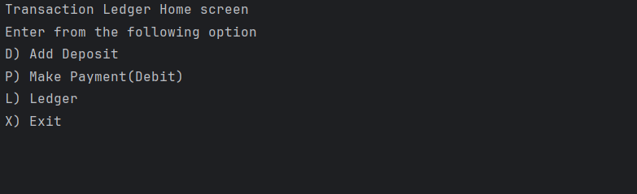
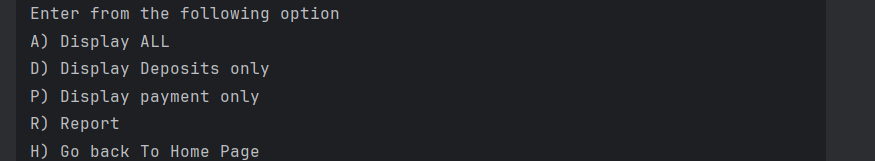
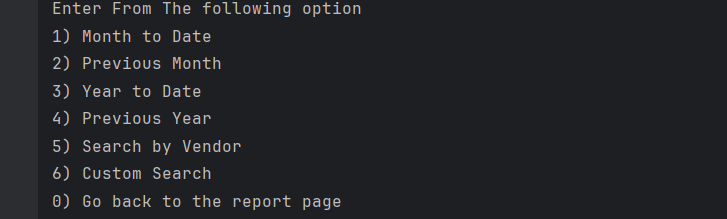

# Accounting Ledger Application
### This is a Java CLI application that allows users to:
* Add deposits and Payments
* Track Financial transactions with time and date
* Generate detailed financial reports
* Search by vendor or perform a custom search 

All transactions are stored in a transaction.csv file and printed in a formatted table for easy reading.

### Main menu

### Ledger menu

### Report menu

## How to Run This Application
1. Clone or download This repository.
2. Open the project in Intellij IDEA (or any Java IDE).
3. Make sure you have Java 17+ installed.
4. Run the 'main()' method from the 'TransactionLedger' class.
5. The program will launch in the terminal (CLI) and guide you with menu options.

**NOTE** All transaction are saved to a file named transaction.csv. Make sure this file is in the same working directory as the application. If it doesn't exist, it will be created automatically when a deposit or payment is made
### Interesting Code: Calculating The previous Month's Date Range
one interesting part of my project is how I get the first and last day of the previous month using Java's LocalDate:
// Get the first day of the previous month
LocalDate firstDayOfPreviousMonth=LocalDate.now().minusMonths(1).withDayOfMonth(1);
//Get the last day of the previous month
LocalDate lastDayOfPreviousMonth=LocalDate.now().minusMonths(1).withDayOfMonth(LocalDate.now().minusMonths(1).lengthOfMonth());

This code uses LocalDate.now() to get the current date, then subtracts one month with .minusMonths(1).

• withDayOfMonth(1) gives the first day of that month

• lengthOfMonth() helps find the last day, even if it’s 28, 30, or 31 days

I used this logic in my report feature to filter transactions that happened during the previous month.
